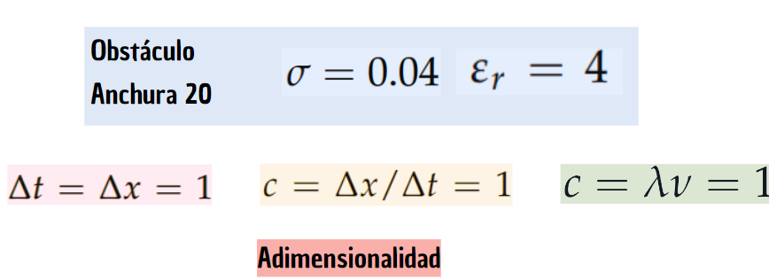
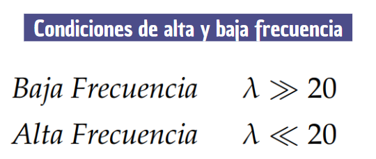
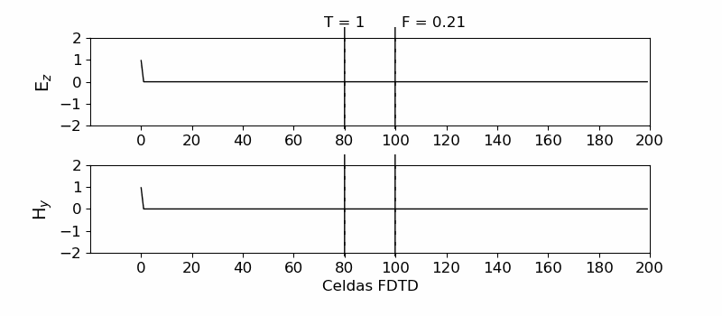
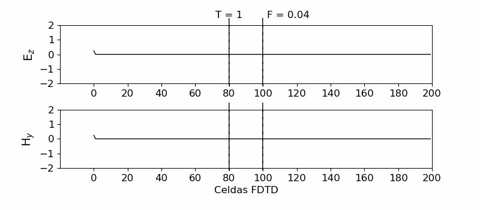

# FDTD Computational Electromagnetism

In this repository I show the Python code used for the TFG. The code has comments for the reader to understand the procedure and each block of code. The latest version is FDTD-last.py .

A one-dimensional implementation of the finite-difference time-domain method (FDTD)  in the Python
programming language.


## Authors

- [@noah-es](https://github.com/noah-es)


## Deployment

To deploy this project run the FDTD-last.py code.

```bash
  python FDTD-last.py
```


## Take a look

* General Conditions: The proposed example plays with dimensionlessness, to make the code more efficient. In our case, space and time are quantized in quanta of 1 unit, both spatial and temporal. In addition, the speed of light travels through a quantum of space in a quantum of time, so it is worth 1. This greatly simplifies the relationship between c, the wavelength and the frequency of light. 



* Frequency Conditions: Therefore, for this example, the following scenarios are considered, both divided by the cut-off frequency F<sub>0</sub>.



* High Frequency: An electromagnetic wave (components of the electric and magnetic field) of frequency 0.21 units can be seen travelling through space, colliding with a barrier (bounded by two vertical bars). The phenomena of reflection and transmission are noteworthy.



* Low Frequency: An electromagnetic wave (components of the electric and magnetic field) of frequency 0.04 units can be seen travelling through space, colliding with a barrier (bounded by two vertical bars). The phenomena of reflection and transmission are noteworthy.



It is logically observed that the wave with a higher frequency has an electrical size similar to the size of the barrier, which acts as a wall against the advancing electromagnetic wave. The transmission coefficient is very low. The wave practically dissipates after passing through the wall.

 On the other hand, at lower frequencies, the electrical size of the wave is larger than the size of the barrier, thus not being an obstacle and practically not altering the displacement of the wave.

This is a clear example of how WiFis, or radio waves, work.
